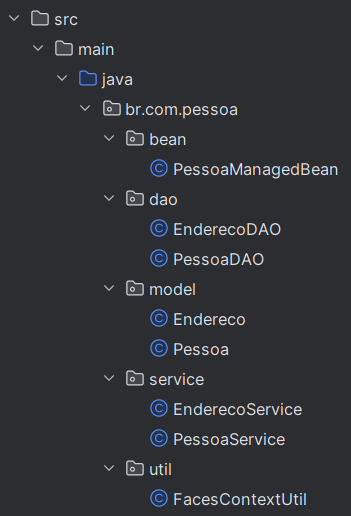
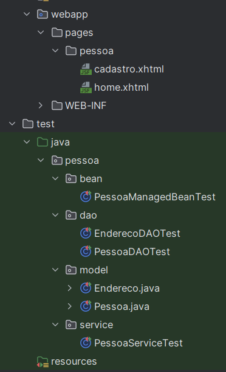

# Projeto de Cadastro de Pessoas

O Sistema tem o objetivo de cadastrar, listar, atualizar e deletar informações de pessoas (nome, idade e sexo) e 
informaçoes de endereço (estado, cidade, logradouro, bairro, número, cep e o id da pessoa) também são armazenadas.

## Observações importantes
O Sistema está ulitizando um serviço chamado "viacep" que tem o objetivo de agilizar o processo de preenchimento dos 
campos de Endereço, o que facilita a captação de dados proximos da realidade, entretanto os campos não são somente 
leitura o que permite mudar os dados conforme o interesse do usuário, um dos campos que este serviço retorna é o bairro
sendo assim no tabela Endereço foi acrescentada a coluna bairro.

## Arquitetura
 A arquitetura do Projeto Pessoa é composta pelas seguintes camadas: Model, Dao, Bean e Service.
Aqui estão alguns detalhes sobre a arquitetura do projeto: 

Figura 1 - Backend.

Figura 2 - Frontend e Testes. 

## Configurações

O sistema foi feito utilizando: 

* IntelliJ IDEA 2024.1 (Ultimate Edition);
* Java version "1.8.0_401"
* Apache Maven 3.6.3
* wildfly-9.0.1.Final
* Dbeaver usando PostgreSQL 16.2, compiled by Visual C++ build 1937, 64-bit
* Google Chrome e Mozilla Firefox

## Script para criação das tabelas: Pessoa e Endereço

CREATE TABLE pessoa (
id serial PRIMARY KEY,
nome varchar(150) NOT NULL,
idade date,
sexo varchar(2));

CREATE TABLE endereco (
id serial PRIMARY KEY,
estado varchar(2),
cidade varchar(100),
logradouro varchar(100),
bairro VARCHAR(100),
numero int,
cep varchar(8),
id_pessoa int REFERENCES pessoa(id)
);

## Script para obter todos os dados
select * from pessoa p inner join endereco e on p.id = e.id_pessoa

## Importar Projeto

Para importar um projeto JSF que está em um arquivo ZIP para o IntelliJ IDEA, siga estes passos:

1. Descompacte o Arquivo ZIP:
*  Primeiro, você precisa extrair o conteúdo do arquivo ZIP para uma pasta em seu computador.
2. Abra o IntelliJ IDEA:
* Se o IntelliJ já estiver aberto, vá para "File" > "Close Project" para voltar à tela inicial.
3. Iniciar a Importação:
* Na tela inicial, clique em "Open" ou "Import Project". Se você já estiver em um projeto aberto, pode ir para "File" > "New" > "Project from Existing Sources...".
4. Selecione o Diretório do Projeto Descompactado:
* Navegue até a pasta onde você descompactou o arquivo ZIP e selecione o diretório principal do projeto. Clique em "OK".
5. Escolha a Opção de Importação:
* Se for solicitado, escolha "Import project from external model" e selecione a opção apropriada (por exemplo, Maven, Gradle, etc.), caso o projeto use algum desses sistemas de build. Se não, escolha "Create project from existing sources".
6. Configurações de Importação:
* Siga as instruções na tela para configurar o projeto. O IntelliJ pode pedir para você configurar o SDK (JDK) e outras dependências.
7. Reconhecimento de Frameworks:
* O IntelliJ tentará detectar quais frameworks estão sendo usados (como JSF, JPA, etc.). Certifique-se de marcar as caixas apropriadas para configurar os frameworks automaticamente.
8. Finalize a Importação:
* Continue seguindo as instruções para revisar as configurações de projeto e concluir o processo de importação.
9. Verifique as Configurações do Projeto:
* Após a importação, vá para "File" > "Project Structure" e verifique se todas as configurações, como módulos, bibliotecas e o SDK do Java, estão corretas.
10. Executar o Projeto:
* Configure os artefatos de implantação e o servidor (se necessário) em "Run" > "Edit Configurations". Adicione uma nova configuração de servidor, como Tomcat ou WildFly, apontando para o artefato principal do seu projeto.

## Compilação
* Clica com o botão direito do mouse no projeto, clica em Maven e depois em Reload Project
## Execução 
Após importar o WildFly Server na aba Server:
* Especifique qual navegador será utilizado
* Informe qual url será aberta:
* Para adicionar Pessoa: http://localhost:8080/Pessoa-1.0-SNAPSHOT/pages/pessoa/cadastro.xhtml
* Para listar as pessoas: http://localhost:8080/Pessoa-1.0-SNAPSHOT/pages/pessoa/home.xhtml
* Em JRE escolher o Java 8 
* Na aba Deployment clicar no + e escolher Pessoa:war e clicar em Apply e OK 
* Clicar no botão Run ou Debug

# Documentação do Projeto
## Histórias de Usuário
* História 1: Adicionar uma Pessoa
Como um administrador
Eu quero adicionar uma nova pessoa ao sistema
Para que possamos rastrear informações sobre novos indivíduos envolvidos em nossas operações.

Critérios de Aceitação:

O usuário pode inserir nome, idade, sexo e endereço da pessoa.
O sistema valida os dados inseridos para garantir que todos os campos obrigatórios estão preenchidos.
A pessoa é salva no banco de dados após a validação bem-sucedida.
O usuário recebe uma notificação de sucesso após a criação da pessoa.
* História 2: Visualizar Pessoa
Como um usuário do sistema
Eu quero visualizar a lista de pessoas cadastradas
Para que eu possa encontrar informações de contato e detalhes rapidamente.

Critérios de Aceitação:

Todos os usuários podem ver uma lista de pessoas no sistema.
A lista inclui informações importantes como nome, idade, sexo e endereço.
Os usuários podem pesquisar pessoas por nome.
* História 3: Atualizar Informações da Pessoa
Como um administrador
Eu quero atualizar as informações de uma pessoa existente
Para que possamos manter os dados precisos e atualizados.

Critérios de Aceitação:

O usuário pode selecionar uma pessoa da lista e editar suas informações.
O sistema permite a edição de nome, idade, sexo e endereço.
As mudanças são validadas e salvas no banco de dados.
O usuário recebe uma notificação de sucesso após a atualização dos dados.
* História 4: Deletar Pessoa
Como um administrador
Eu quero remover uma pessoa do sistema
Para que possamos manter nossa base de dados limpa de registros não necessários ou duplicados.

Critérios de Aceitação:

O usuário pode selecionar uma pessoa da lista e optar por deletá-la.
O sistema solicita confirmação antes de proceder com a exclusão.
A pessoa é removida do banco de dados após a confirmação.
O usuário recebe uma notificação de sucesso após a exclusão.

## Testes

Instruções sobre como executar os testes: abrir qualquer arquivo de teste, caso queira executar todos os testes, tem que
clicar com o botão direito do mouse em Debug na parte mais superior da classe, caso deseje executar um teste especifico,
é preciso fazer o mesmo procediemnto proximo ao teste.

## Contribuições

[Assista ao Vídeo](https://youtu.be/AsSpVT6isrg?si=xDzlrNsIbyE5iBVO)

# Autor 
Benedilson de Jesus Batista de Lima

